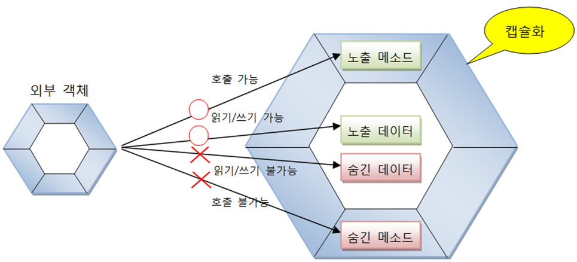
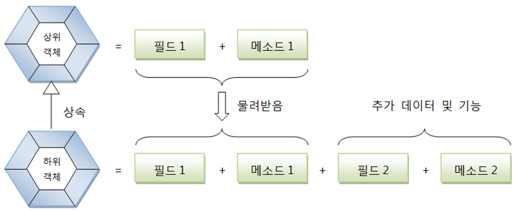
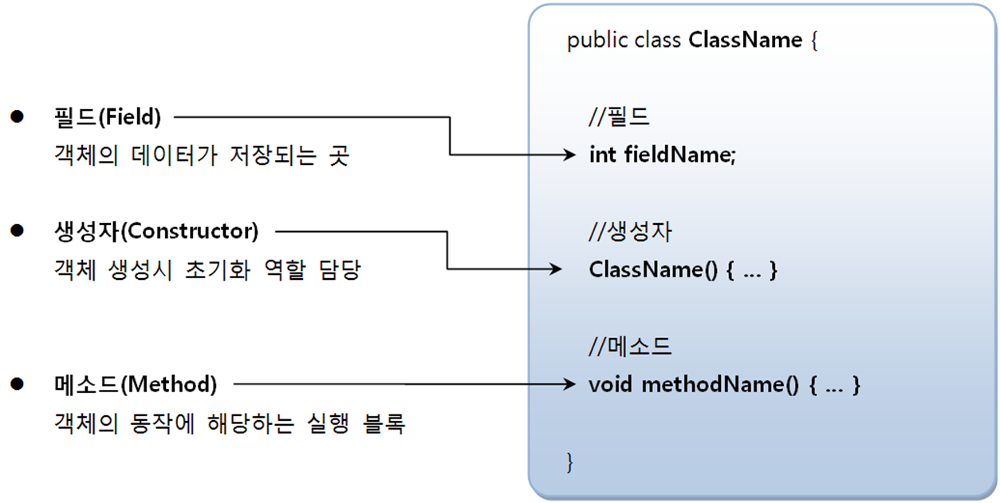
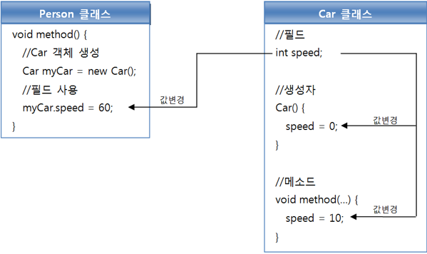
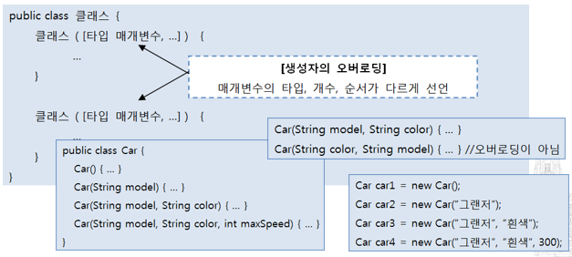
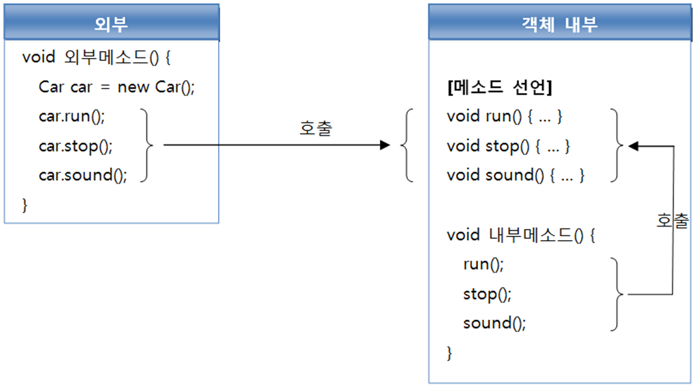
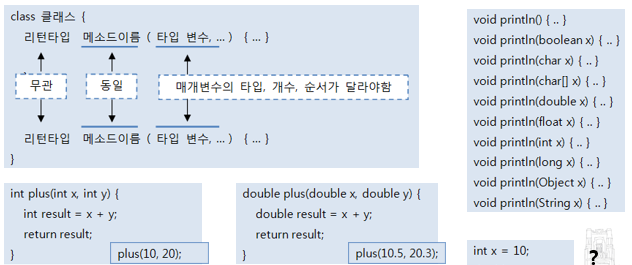

<p align="center">
  
</p>

# 목차
- [목차]()
- [06. 클래스]()

#06 클래스

## 6.1 객체 지향 프로그래밍
> OOP: Object Oriented Programming
- 부품 객체를 먼저 만들고 이것들을 하나씩 조립해 완성된 프로그램을 만드는 기법

### 6.1.1 객체란?
- 물리적으로 존재하는 것 (자동차, 책, 사람)
- 추상적인 것(회사, 날짜) 중에서 자신의 속성과 동작을 가지는 모든 것
- 객체는 필드(속성) 과 메소드(동작)로 구성된 자바 객체로 모델링 가능

### 6.1.2 객체의 상호작용
- 객체들은 서로 간에 기능(동작)을 이용하고 데이터를 주고 받음

### 6.1.3 객체 간의 관계
- 객체간의 관계
- 객체 지향 프로그램에서는 객체는 다른 객체와 관계를 맺음
- 관계의 종류
    - 집합 관계: 완성품과 부품의 관계
    - 사용 관계: 객체가 다른 객체를 사용하는 관계
    - 상속 관계: 종류 객체와 구체적인 사물 객체 관계
  
### 6.1.4 객체 지향 프로그래밍의 특징
- **캡슐화(Encapsulation)**
  - 객체의 필드, 메소드를 하나로 묶고, 실제 구현 내용을 감추는 것
  - 외부 객체는 객체 내부 구조를 알지 못하며 객체가 노출해 제공하는 필드와 메소드만 이용 가능
  - 필드와 메소드를 캡슐화하여 보호하는 이유는 외부의 잘못된 사용으로 인해 객체가 손상되지 않도록 
  - 자바 언어는 캡슐화된 멤버를 노출시킬 것인지 숨길 것인지 결정하기 위해 **접근 제한자(Access Modifier) 사용**



- **상속(Inheritance)**
  - 상위(부모) 객체의 필드와 메소드를 하위(자식) 객체에게 물려주는 행위
  - 하위 객체는 상위 객체를 확장해서 추가적인 필드와 메소드를 가질 수 있음
  - 상속 대상: 필드와 메소드
  - 상속의 효과
    - 상위 객체를 재사용해서 하위 객체를 빨리 개발 가능
    - 반복된 코드의 중복을 줄임
    - 유지 보수의 편리성 제공
    - 객체의 다형성 구현



- **다형성(Polymorphism)**
  - 같은 타입이지만 실행 결과가 다양한 객체를 대입할 수 있는 성질
    - 부모 타입에는 모든 자식 객체가 대입
    - 인터페이스 타입에는 모든 구현 객체가 대입
  - 효과
    - 객체를 부품화시키는 것 가능
    - 유지보수 용이


## 6.2 객체와 클래스
- 현실세계:설계도 -> 객체
- 자바: 클래스 -> 객체
- 클래스에는 객체를 생성하기 위한 필드와 메소드가 정의
- 클래스로부터 만들어진 객체를 해당 클래스의 인스턴스(instance)
- 하나의 클래스로부터 여러 개의 인스턴스를 만들 수 있음

## 6.3 클래스 선언

### 6.3.1 클래스 이름
```
1. 하나 이상의 문자로 이루어져야 한다.
2. 첫 번째 글자는 숫자가 올 수 없다.
3. '$', '_'외의 특수 문자는 사용할 수 없다.
4. 자바 키워드는 사용할 수 없다.

> Ex)  
> Calculator, Car, Member, ChatClient, ChatSever (O)  
> 3Car, @Car, $Car, sportsCar int (X)
```
- 한글 이름도 가능하나, 영어 이름으로 작성
- 알파벳 대소문자는 서로 다른 문자로 인식
- 첫 글자와 연결된 다른 단어의 첫 글자는 대문자로 작성하는 것이 관례

### 6.3.2 클래스 선언과 컴파일
- 소스 파일 생성: 클래스이름.java (대소문자 주의)
- 소스 작성
- 소스 파일당 하나의 클래스를 선언하는 것이 관례
  - 두 개 이상의 클래스도 선언 가능
  - 소스 파일 이름과 동일한 클래스만 public으로 선언 가능
  - 선언한 개수만큼 바이트 코드 파일이 생성

## 6.4 객체 생성과 클래스 변수

### new 연산자
- 객체 생성 역할
  - 클래스()는 생성자를 호출하는 코드
  - 생성된 객체는 힙 메모리 영역에 생성
- new 연산자는 객체를 생성 후, 객체 생성 번지 리턴

### 클래스 변수
- 클래스 변수
  - new 연산자에 의해 리턴 된 객체의 번지 저장 (참조 타입 변수)
  - 힙 영역의 객체를 사용하기 위해 사용

### 클래스의 용도
- 라이브러리(API: Application Program Interface) 용
  - 자체적으로 실행되지 않음
  - 다른 클래스에서 이용할 목적으로 만든 클래스

- 실행용
  - main() 메소드를 가지고 있는 클래스로 실행할 목적으로 만든 클래스

## 6.5 클래스의 구성 멤버
- 필드(Field)
- 생성자(Constructor)
- 메소드(Method)


### 6.6 필드
- 필드의 내용
  - 객체의 고유 데이터
  - 객체가 가져야 할 부품 객체
  - 객체의 현재 상태 데이터
- 필드 사용
  - 필드 값을 읽고, 변경하는 작업을 말한다.
  - 필드 사용 위치
    - 객체 내부: “필드이름” 으로 바로 접근
    - 객체 외부: “변수.필드이름”으로 접근 



## 6.7 생성자
- new 연산자에 의해 호출되어 객체의 초기화 담당
  - 필드의 값 설정
  - 메소드 호출해  객체를 사용할 수 있도록 준비하는 역할 수행

### 6.7.1 기본 생성자(Default Constructor)
- 모든 클래스는 생성자가 반드시 존재하며 하나 이상 가질 수 있음
- 생성자 선언을 생략하면 컴파일러는 다음과 같은 기본 생성자 추가

### 6.7.2 생성자 선언
- 디폴트 생성자 대신 개발자가 직접 선언
- 개발자 선언한 생성자 존재 시 컴파일러는 기본 생성자 추가하지 않음
  - new 연산자로 객체 생성시 개발자가 선언한 생성자 반드시 사용

### 6.7.3 필드 초기화
- 초기값 없이 선언된 필드는 객체가 생성될 때 기본값으로 자동 설정
- 다른 값으로 필드 초기화하는 방법
  - 필드 선언할 때 초기값 설정
  - 생성자의 매개값으로 초기값 설정
  - 매개 변수와 필드명 같은 경우 this 사용
```
public class Main() {
  public static void main(String[] args) {
    Car car1 = new Car("그랜져", "흰색"); // 생성자의 매개값으로 초기값 설정
  }
}

public class Car() {
  String name;
  String color;

  public Car(String name, String color) {
    this.name = name; // 매개 변수와 필드명 같은 경우 this 사용
    this.color = color;
  }
}

```

### 6.7.4 생성자 오버로딩(Overloading)
- 생성자 다양화해야 하는 이유
  - 객체 생성할 때 외부 값으로 객체를 초기화할 필요
  - 외부 값이 어떤 타입으로 몇 개가 제공될 지 모름 - 생성자도 다양화


- 생성자 오버로딩(Overloading)
  - 매개변수의 타입, 개수, 순서가 다른 생성자 여러 개 선언



### 6.7.5 다른 생성자 호출(this())
- 생성자 오버로딩되면 생성자 간의 중복된 코드 발생
- 초기화 내용이 비슷한 생성자들에서 이러한 현상을 많이 볼 수 있음
  - 초기화 내용을 한 생성자에 몰아 작성
  - 다른 생성자는 초기화 내용을 작성한 생성자를 this(…)로 호출
```
public class Car() {
  String name;
  String color;
  
  Car() {}
  
  Car(String model) {
    this(model, "은색"); // 자기 자신의 다른 생성자를 호출, 첫줄에서만 허용
  }
  
  Car(String name, String color) {
    this.name = name;
    this.color = color;
  }
}

```
## 6.8 메소드
메소드란?
- 객체의 동작(기능)
- 호출해서 실행할 수 있는 중괄호 { } 블록
- 메소드 호출하면 중괄호 { } 블록에 있는 모든 코드들이 일괄 실행

### 6.8.1 메소드 선언
- 메소드 선언은 선언부(리턴타입, 메소드 이름, 매개변수 선언)과 실행 블록으로 구성
- **리턴 타입**
  - 메소드 실행된 후 리턴하는 값의 타입
  - 메소드는 리턴값이 있을 수도 있고 없을 수도 있음
- **메소드 이름**
  - 자바 식별자 규칙에 맞게 작성 (메소드명의 첫 글자는 소문자로, 혼합 단어는 뒤이어 오는 단어의 첫머리 글자 대문자)
- **매개 변수 선언**
  - 매개변수는 메소드를 실행할 때 필요한 데이터를 외부에서 받기 위해 사용
  - 매개변수도 필요 없을 수 있음

### 6.8.2 리턴(return) 문
- 메소드 실행을 중지하고 리턴값 지정하는 역할
- **리턴값이 있는 메소드**
  - 반드시 리턴(return)문 사용해 리턴값 지정해야
  - return 문 뒤에 실행문 올 수 없음
- **리턴값이 없는 메소드**
  - 메소드 실행을 강제 종료 시키는 역할

### 6.8.3 메소드 호출
- 메소드는 클래스 내∙외부의 호출에 의해 실행
  - 클래스 내부: 메소드 이름으로 호출
  - 클래스 외부: 객체 생성 후, 참조 변수를 이용해 호출



### 6.8.4 메소드 오버로딩(Overloading)
- 클래스 내에 같은 이름의 메소드를 여러 개 선언하는 것
- 하나의 메소드 이름으로 다양한 매개값 받기 위해 메소드 오버로딩
- 오버로딩의 조건: 매개변수의 타입, 개수, 순서가 달라야 함 
