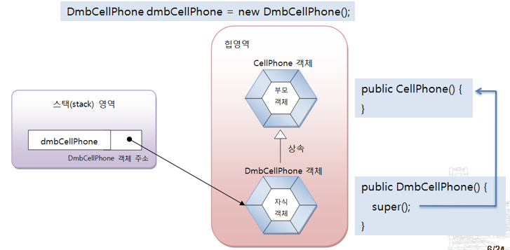
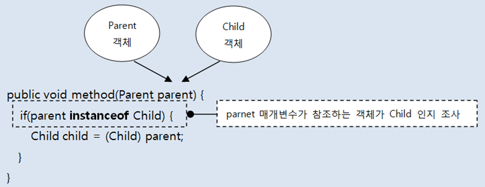

<p align="center">
  
</p>

# 목차
- [06 클래스](#06-클래스)
  * [6.1 객체 지향 프로그래밍](#61-객체-지향-프로그래밍)
    + [6.1.1 객체란?](#611-객체란)
    + [6.1.2 객체의 상호작용](#612-객체의-상호작용)
    + [6.1.3 객체 간의 관계](#613-객체-간의-관계)
    + [6.1.4 객체 지향 프로그래밍의 특징](#614-객체-지향-프로그래밍의-특징)
  * [6.2 객체와 클래스](#62-객체와-클래스)
  * [6.3 클래스 선언](#63-클래스-선언)
    + [6.3.1 클래스 이름](#631-클래스-이름)
    + [6.3.2 클래스 선언과 컴파일](#632-클래스-선언과-컴파일)
  * [6.4 객체 생성과 클래스 변수](#64-객체-생성과-클래스-변수)
    + [new 연산자](#new-연산자)
    + [클래스 변수](#클래스-변수)
    + [클래스의 용도](#클래스의-용도)
  * [6.5 클래스의 구성 멤버](#65-클래스의-구성-멤버)
    + [6.6 필드](#66-필드)
  * [6.7 생성자](#67-생성자)
    + [6.7.1 기본 생성자(Default Constructor)](#671-기본-생성자default-constructor)
    + [6.7.2 생성자 선언](#672-생성자-선언)
    + [6.7.3 필드 초기화](#673-필드-초기화)
    + [6.7.4 생성자 오버로딩(Overloading)](#674-생성자-오버로딩overloading)
    + [6.7.5 다른 생성자 호출(this())](#675-다른-생성자-호출this)
  * [6.8 메소드](#68-메소드)
    + [6.8.1 메소드 선언](#681-메소드-선언)
    + [6.8.2 리턴(return) 문](#682-리턴return)
    + [6.8.3 메소드 호출](#683-메소드-호출)
    + [6.8.4 메소드 오버로딩(Overloading)](#684-메소드-오버로딩overloading)
  * [6.9 인스턴스 멤버와 this](#69-인스턴스-멤버와-this)
  * [6.10 정적 멤버와 static](#610-정적-멤버와-static)
    + [6.10.1 정적 멤버 선언](#6101-정적-멤버-선언)
    + [6.10.2 정적 멤버 사용](#6102-정적-멤버-사용)
    + [6.10.3 정적 초기화 블록](#6103-정적-초기화-블록)
    + [6.10.4 정적 메소드와 정적 블록 작성시 주의할 점](#6104-정적-메소드와-정적-블록-작성시-주의할-점)
    + [6.10.5 싱글톤(Singleton)](#6105-싱글톤singleton)
  * [6.11 final 필드와 상수](#611-final-필드와-상수)
    + [6.11.1 final 필드](#6111-final-필드)
    + [6.11.2 상수(static final)](#6112-상수static-final)
  * [6.12 패키지(package)](#612-패키지package)
    + [6.12.4 import 문](#6124-import-문)
  * [6.13 접근 제한자](#613-접근-제한자)
    + [6.13.1 클래스의 접근 제한](#6131-클래스의-접근-제한)
  * [6.14 Getter와 Setter 메소드](#614-getter와-setter-메소드)
  * [6.15 어노테이션](#615-어노테이션)
    + [6.15.1 어노테이션 타입 정의와 적용](#6151-어노테이션-타입-정의와-적용)
    + [6.15.2 어노테이션 적용 대상](#6152-어노테이션-적용-대상)
    + [6.15.3 어노테이션 유지 정책](#6153-어노테이션-유지-정책)
    + [6.15.4 런타임시 어노테이션 정보 사용하기](#6154-런타임시-어노테이션-정보-사용하기)

# 06 클래스

## 6.1 객체 지향 프로그래밍
> OOP: Object Oriented Programming
- 부품 객체를 먼저 만들고 이것들을 하나씩 조립해 완성된 프로그램을 만드는 기법

### 6.1.1 객체란?
- 물리적으로 존재하는 것 (자동차, 책, 사람)
- 추상적인 것(회사, 날짜) 중에서 자신의 속성과 동작을 가지는 모든 것
- 객체는 필드(속성) 과 메소드(동작)로 구성된 자바 객체로 모델링 가능

### 6.1.2 객체의 상호작용
- 객체들은 서로 간에 기능(동작)을 이용하고 데이터를 주고 받음

### 6.1.3 객체 간의 관계
- 객체간의 관계
- 객체 지향 프로그램에서는 객체는 다른 객체와 관계를 맺음
- 관계의 종류
    - 집합 관계: 완성품과 부품의 관계
    - 사용 관계: 객체가 다른 객체를 사용하는 관계
    - 상속 관계: 종류 객체와 구체적인 사물 객체 관계
  
### 6.1.4 객체 지향 프로그래밍의 특징
- **캡슐화(Encapsulation)**
  - 객체의 필드, 메소드를 하나로 묶고, 실제 구현 내용을 감추는 것
  - 외부 객체는 객체 내부 구조를 알지 못하며 객체가 노출해 제공하는 필드와 메소드만 이용 가능
  - 필드와 메소드를 캡슐화하여 보호하는 이유는 외부의 잘못된 사용으로 인해 객체가 손상되지 않도록 
  - 자바 언어는 캡슐화된 멤버를 노출시킬 것인지 숨길 것인지 결정하기 위해 **접근 제한자(Access Modifier) 사용**


- **상속(Inheritance)**
  - 상위(부모) 객체의 필드와 메소드를 하위(자식) 객체에게 물려주는 행위
  - 하위 객체는 상위 객체를 확장해서 추가적인 필드와 메소드를 가질 수 있음
  - 상속 대상: 필드와 메소드
  - 상속의 효과
    - 상위 객체를 재사용해서 하위 객체를 빨리 개발 가능
    - 반복된 코드의 중복을 줄임
    - 유지 보수의 편리성 제공
    - 객체의 다형성 구현


- **다형성(Polymorphism)**
  - 같은 타입이지만 실행 결과가 다양한 객체를 대입할 수 있는 성질
    - 부모 타입에는 모든 자식 객체가 대입
    - 인터페이스 타입에는 모든 구현 객체가 대입
  - 효과
    - 객체를 부품화시키는 것 가능
    - 유지보수 용이


## 6.2 객체와 클래스
- 현실세계:설계도 -> 객체
- 자바: 클래스 -> 객체
- 클래스에는 객체를 생성하기 위한 필드와 메소드가 정의
- 클래스로부터 만들어진 객체를 해당 클래스의 인스턴스(instance)
- 하나의 클래스로부터 여러 개의 인스턴스를 만들 수 있음

## 6.3 클래스 선언

### 6.3.1 클래스 이름
```
1. 하나 이상의 문자로 이루어져야 한다.
2. 첫 번째 글자는 숫자가 올 수 없다.
3. '$', '_'외의 특수 문자는 사용할 수 없다.
4. 자바 키워드는 사용할 수 없다.

> Ex)  
> Calculator, Car, Member, ChatClient, ChatSever (O)  
> 3Car, @Car, $Car, sportsCar int (X)
```
- 한글 이름도 가능하나, 영어 이름으로 작성
- 알파벳 대소문자는 서로 다른 문자로 인식
- 첫 글자와 연결된 다른 단어의 첫 글자는 대문자로 작성하는 것이 관례

### 6.3.2 클래스 선언과 컴파일
- 소스 파일 생성: 클래스이름.java (대소문자 주의)
- 소스 작성
- 소스 파일당 하나의 클래스를 선언하는 것이 관례
  - 두 개 이상의 클래스도 선언 가능
  - 소스 파일 이름과 동일한 클래스만 public으로 선언 가능
  - 선언한 개수만큼 바이트 코드 파일이 생성

## 6.4 객체 생성과 클래스 변수

### new 연산자
- 객체 생성 역할
  - 클래스()는 생성자를 호출하는 코드
  - 생성된 객체는 힙 메모리 영역에 생성
- new 연산자는 객체를 생성 후, 객체 생성 번지 리턴

### 클래스 변수
- 클래스 변수
  - new 연산자에 의해 리턴 된 객체의 번지 저장 (참조 타입 변수)
  - 힙 영역의 객체를 사용하기 위해 사용

### 클래스의 용도
- 라이브러리(API: Application Program Interface) 용
  - 자체적으로 실행되지 않음
  - 다른 클래스에서 이용할 목적으로 만든 클래스

- 실행용
  - main() 메소드를 가지고 있는 클래스로 실행할 목적으로 만든 클래스

## 6.5 클래스의 구성 멤버
- 필드(Field)
- 생성자(Constructor)
- 메소드(Method)


### 6.6 필드
- 필드의 내용
  - 객체의 고유 데이터
  - 객체가 가져야 할 부품 객체
  - 객체의 현재 상태 데이터
- 필드 사용
  - 필드 값을 읽고, 변경하는 작업을 말한다.
  - 필드 사용 위치
    - 객체 내부: “필드이름” 으로 바로 접근
    - 객체 외부: “변수.필드이름”으로 접근 


## 6.7 생성자
- new 연산자에 의해 호출되어 객체의 초기화 담당
  - 필드의 값 설정
  - 메소드 호출해  객체를 사용할 수 있도록 준비하는 역할 수행

### 6.7.1 기본 생성자(Default Constructor)
- 모든 클래스는 생성자가 반드시 존재하며 하나 이상 가질 수 있음
- 생성자 선언을 생략하면 컴파일러는 다음과 같은 기본 생성자 추가

### 6.7.2 생성자 선언
- 디폴트 생성자 대신 개발자가 직접 선언
- 개발자 선언한 생성자 존재 시 컴파일러는 기본 생성자 추가하지 않음
  - new 연산자로 객체 생성시 개발자가 선언한 생성자 반드시 사용

### 6.7.3 필드 초기화
- 초기값 없이 선언된 필드는 객체가 생성될 때 기본값으로 자동 설정
- 다른 값으로 필드 초기화하는 방법
  - 필드 선언할 때 초기값 설정
  - 생성자의 매개값으로 초기값 설정
  - 매개 변수와 필드명 같은 경우 this 사용
```
public class Main() {
  public static void main(String[] args) {
    Car car1 = new Car("그랜져", "흰색"); // 생성자의 매개값으로 초기값 설정
  }
}

public class Car() {
  String name;
  String color;

  public Car(String name, String color) {
    this.name = name; // 매개 변수와 필드명 같은 경우 this 사용
    this.color = color;
  }
}

```

### 6.7.4 생성자 오버로딩(Overloading)
- 생성자 다양화해야 하는 이유
  - 객체 생성할 때 외부 값으로 객체를 초기화할 필요
  - 외부 값이 어떤 타입으로 몇 개가 제공될 지 모름 - 생성자도 다양화


- 생성자 오버로딩(Overloading)
  - 매개변수의 타입, 개수, 순서가 다른 생성자 여러 개 선언


### 6.7.5 다른 생성자 호출(this())
- 생성자 오버로딩되면 생성자 간의 중복된 코드 발생
- 초기화 내용이 비슷한 생성자들에서 이러한 현상을 많이 볼 수 있음
  - 초기화 내용을 한 생성자에 몰아 작성
  - 다른 생성자는 초기화 내용을 작성한 생성자를 this(…)로 호출
```java
public class Car() {
  String name;
  String color;
  
  Car() {}
  
  Car(String model) {
    this(model, "은색"); // 자기 자신의 다른 생성자를 호출, 첫줄에서만 허용
  }
  
  Car(String name, String color) {
    this.name = name;
    this.color = color;
  }
}

```
## 6.8 메소드
메소드란?
- 객체의 동작(기능)
- 호출해서 실행할 수 있는 중괄호 { } 블록
- 메소드 호출하면 중괄호 { } 블록에 있는 모든 코드들이 일괄 실행

### 6.8.1 메소드 선언
- 메소드 선언은 선언부(리턴타입, 메소드 이름, 매개변수 선언)과 실행 블록으로 구성
- **리턴 타입**
  - 메소드 실행된 후 리턴하는 값의 타입
  - 메소드는 리턴값이 있을 수도 있고 없을 수도 있음
- **메소드 이름**
  - 자바 식별자 규칙에 맞게 작성 (메소드명의 첫 글자는 소문자로, 혼합 단어는 뒤이어 오는 단어의 첫머리 글자 대문자)
- **매개 변수 선언**
  - 매개변수는 메소드를 실행할 때 필요한 데이터를 외부에서 받기 위해 사용
  - 매개변수도 필요 없을 수 있음

### 6.8.2 리턴(return) 문
- 메소드 실행을 중지하고 리턴값 지정하는 역할
- **리턴값이 있는 메소드**
  - 반드시 리턴(return)문 사용해 리턴값 지정해야
  - return 문 뒤에 실행문 올 수 없음
- **리턴값이 없는 메소드**
  - 메소드 실행을 강제 종료 시키는 역할

### 6.8.3 메소드 호출
- 메소드는 클래스 내∙외부의 호출에 의해 실행
  - 클래스 내부: 메소드 이름으로 호출
  - 클래스 외부: 객체 생성 후, 참조 변수를 이용해 호출


### 6.8.4 메소드 오버로딩(Overloading)
- 클래스 내에 같은 이름의 메소드를 여러 개 선언하는 것
- 하나의 메소드 이름으로 다양한 매개값 받기 위해 메소드 오버로딩
- 오버로딩의 조건: 매개변수의 타입, 개수, 순서가 달라야 함 


## 6.9 인스턴스 멤버와 this
- 객체(인스턴스) 마다 가지고 있는 필드와 메소드
  - 이들을 각각 인스턴스 필드, 인스턴스 메소드라고 부름
- 인스턴스 멤버는 객체 소속된 멤버이기 때문에 객체가 없이 사용불가
- **this**
  - 객체(인스턴스) 자신의 참조(번지)를 가지고 있는 키워드
  - 객체 내부에서 인스턴스 멤버임을 명확히 하기 위해 this. 사용
  - 매개변수와 필드명이 동일할 때 인스턴스 필드임을 명확히 하기 위해 사용
```java
Car(String model) {
  this.model = model;
}

void setModel(String model) {
  this.model = model;
}

```

## 6.10 정적 멤버와 static
- 클래스에 고정된 필드와 메소드 - 정적 필드, 정적 메소드

- 정적 멤버는 클래스에 소속된 멤버
  - 객체 내부에 존재하지 않고, 메소드 영역에 존재
  - 정적 멤버는 객체를 생성하지 않고 클래스로 바로 접근해 사용

### 6.10.1 정적 멤버 선언
- 필드 또는 메소드 선언할 때 static 키워드 붙임

### 6.10.2 정적 멤버 사용
- 클래스 이름과 함께 도트(.) 연산자로 접근

- **인스턴스 멤버 선언 vs 정적 멤버 선언의 기준**
  - 필드
    - 객체 마다 가지고 있어야 할 데이터  인스턴스 필드
    - 공용적인 데이터  정적 필드
  - 메소드
    - 인스턴스 필드로 작업해야 할 메소드  인스턴스 메소드
    - 인스턴스 필드로 작업하지 않는 메소드  정적 메소드

### 6.10.3 정적 초기화 블록
- 클래스가 메소드 영역으로 로딩될 때 자동으로 실행하는 블록
- 정적 필드의 복잡한 초기화 작업과 정적 메소드 호출 가능
- 클래스 내부에 여러 개가 선언되면 선언된 순서대로 실행
```java
public class Television {
  static String company = "Samsung";
  static String model = "LCD";
  static String info;

  static {
    info = company + "-" + model;
  }
}

```

### 6.10.4 정적 메소드와 정적 블록 작성시 주의할 점
- 객체가 없어도 실행 가능
- 블록 내부에 인스턴스 필드나 인스턴스 메소드 사용 불가
- 객체 자신의 참조인 this 사용 불가
  - EX) main()

### 6.10.5 싱글톤(Singleton)
- 하나의 애플리케이션 내에서 단 하나만 생성되는 객체
- **싱글톤을 만드는 방법**
  - 외부에서 new 연산자로 생성자를 호출할 수 없도록 막기
    - private 접근 제한자를 생성자 앞에 붙임
  - 클래스 자신의 타입으로 정적 필드 선언
    - 자신의 객체를 생성해 초기화
    - private 접근 제한자 붙여 외부에서 필드 값 변경 불가하도록
  - 외부에서 호출할 수 있는 정적 메소드인 getInstance() 선언
    - 정적 필드에서 참조하고 있는 자신의 객체 리턴

## 6.11 final 필드와 상수
### 6.11.1 final 필드
- 최종적인 값을 갖고 있는 필드 = 값을 변경할 수 없는 필드
- final 필드의 딱 한번의 초기값 지정 방법
  - 필드 선언 시
  - 생성자

### 6.11.2 상수(static final)
- 상수 = 정적 final 필드
  - final 필드: 
    - 객체마다 가지는 **불변의** 인스턴스 필드
  - 상수(static final): 
    - 객체마다 가지고 있지 않음
    - 메소드 영역에 클래스 별로 관리되는 불변의 정적 필드 
    - 공용 데이터로서 사용
- 상수 이름은 전부 대문자로 작성
- 다른 단어가 결합되면 _ 로 연결

## 6.12 패키지(package)
- 클래스를 기능별로 묶어서 그룹 이름을 붙여 놓은 것
  - 파일들을 관리하기 위해 사용하는 폴더(디렉토리)와 비슷한 개념
  - 패키지의 물리적인 형태는 파일 시스템의 폴더
- 클래스 이름의 일부
  - 클래스를 유일하게 만들어주는 식별자
  - 전체 클래스 이름 = 상위패키지.하위패키지.클래스
  - 클래스명이 같아도 패키지명이 다르면 다른 클래스로 취급
- 클래스 선언할 때 패키지 결정
  - 클래스 선언할 때 포함될 패키지 선언
  - 클래스 파일은(~.class) 선언된 패키지와 동일한 폴더 안에서만 동작
  - 클래스 파일은(~.class) 다른 폴더 안에 넣으면 동작하지 않음

### 6.12.4 import 문
- 패키지 내에 같이 포함된 클래스간 클래스 이름으로 사용 가능
- 패키지가 다른 클래스를 사용해야 할 경우
  - 패키지 명 포함된 전체 클래스 이름으로 사용
  - Import 문으로 패키지를 지정하고 사용

## 6.13 접근 제한자
- 클래스 및 클래스의 구성 멤버에 대한 접근을 제한하는 역할
  - 다른 패키지에서 클래스를 사용하지 못하도록 (클래스 제한)
  - 클래스로부터 객체를 생성하지 못하도록 (생성자 제한)
  - 특정 필드와 메소드를 숨김 처리 (필드와 메소드 제한)
- 접근 제한자의 종류


### 6.13.1 클래스의 접근 제한
- default 
  - 클래스 선언할 때 public 생략한 경우 
  - 다른 패키지에서는 사용 불가
- public
  - 다른 개발자가 사용할 수 있도록 라이브러리 클래스로 만들 때 유용

## 6.14 Getter와 Setter 메소드
- 클래스 선언할 때 필드는 일반적으로 private 접근 제한
  - 읽기 전용 필드가 있을 수 있음 (Getter의 필요성)
  - 외부에서 엉뚱한 값으로 변경할 수 없도록 (Setter의 필요성)
- Getter
- private 필드의 값을 리턴 하는 역할 - 필요할 경우 필드 값 가공
- getFieldName() 또는 isFieldName() 메소드
  - 필드 타입이 boolean 일 경우 isFieldName()
- Setter
- 외부에서 주어진 값을 필드 값으로 수정
  - 필요할 경우 외부의 값을 유효성 검사
- setFieldName(타입 변수) 메소드
  - 매개 변수 타입은 필드의 타입과 동일

## 6.15 어노테이션
- 프로그램에게 추가적인 정보를 제공해주는 메타데이터(metadata)
- 어노테이션 용도
  - 컴파일러에게 코드 작성 문법 에러 체크하도록 정보 제공
  - 소프트웨어 개발 툴이 빌드나 배치 시 코드를 자동 생성하게 정보 제공
  - 실행 시(런타임시) 특정 기능 실행하도록 정보 제공

### 6.15.1 어노테이션 타입 정의와 적용
- 어노테이션 타입 정의
  - 소스 파일 생성: AnnotatoinName.java
  - 소스 파일 내용
```java
  public @interface AnnotationName {

  }
  
```
- 어노테이션 타입 적용
```java
@Override
public void toString() {
  ...
}

```
- 기본 엘리먼트 value
  - 어노테이션 적용할 때 엘리먼트 이름 생략 가능 ```@AnnotationName("값");```
  - 두 개 이상의 속성을 기술할 때에는 value=값 형태로 기술 ```@AnnotationName(value="값", elementName=3);```

### 6.15.2 어노테이션 적용 대상
- 코드 상에서 어노테이션을 적용할 수 있는 대상
- java.lang.annotation.ElementType 열거 상수로 정의

### 6.15.3 어노테이션 유지 정책
- 어노테이션 적용 코드가 유지되는 시점을 지정하는 것
- java.lang.annotation.RetentionPolicy 열거 상수로 정의
  - 리플렉션(Reflection): 런타임에 클래스의 메타 정보를 얻는 기능
    - 클래스가 가지고 있는 필드, 생성자, 메소드, 어노테이션의 정보를 얻을 수 있음
    - 런타임 시 어노테이션 정보를 얻으려면 유지 정책을 RUNTIME으로 설정

### 6.15.4 런타임시 어노테이션 정보 사용하기
- 클래스에 적용된 어노테이션 정보 얻기
  - 클래스.class 의 어노테이션 정보를 얻는 메소드 이용
- 필드, 생성자, 메소드에 적용된 어노테이션 정보 얻기
  - 다음 메소드 이용해 java.lang.reflect 패키지의 Field, Constructor, Method 클래스의 배열 얻어냄
  

# 07 상속(Inheritance)

## 7.1 상속 개념
> 현실 세계:
> - 부모가 자식에게 물려주는 행위
> - 부모가 자식을 선택해서 물려줌  

> 객체 지향 프로그램:  
> - 자식(하위, 파생) 클래스가 부모(상위) 클래스의 멤버를 물려받는 것
> - 자식이 부모를 선택해 물려받음
> - 상속 대상: 부모의 필드와 메소드

- 상속의 효과
  - 부모 클래스 재사용해 자식 클래스 빨리 개발 가능
  - 반복된 코드 중복 줄임
  - 유지 보수 편리성 제공
  - 객체 다형성 구현 가능
- 상속 대상 제한
  - 부모 클래스의 private 접근 갖는 필드와 메소드 제외
  - 부모 클래스가 다른 패키지에 있을 경우, default 접근 갖는 필드와 메소드도 제외

## 7.2 클래스 상속
- extends 키워드
  - 자식 클래스가 상속할 부모 클래스를 지정하는 키워
  - (자바는 단일 상속 - 부모 클래스가 여러 개일 수는 없음)
  - 

## 7.3 부모 생성자 호출
- 자식 객체 생성하면 부모 객체도 생성되는가?
  - 부모 없는 자식 없음
    - 자식 객체 생성할 때는 부모 객체부터 생성 후 자식 객체 생성
    - 부모 생성자 호출 완료 후 자식 생성자 호출 완료

- 명시적인 부모 생성자 호출
  - 부모 객체 생성할 때, 부모 생성자 선택해 호출
    - super(매개값,…) 
    - 매개값과 동일한 타입, 개수, 순서 맞는 부모 생성자 호출
    - 부모 생성자 없다면 컴파일 오류 발생
    - 반드시 자식 생성자의 첫 줄에 위치
    - 부모 클래스에 기본(매개변수 없는) 생성자가 없다면 필수 작성
```java
public class People {
  public String name;
  public String ssn;

  public People(String name, String ssn) {
    this.name = name;
    this.ssn = ssn;
  }
}

public class Student {
  public String studentId;

  public Student(String name, String ssn) {
    super(name, ssn);
    this.studentId = studentId;
  }
}
 
```
## 7.4 메소드 재정의
### 7.4.1 메소드 재정의(@Override)
- 부모 클래스의 상속 메소드 수정해 자식 클래스에서 재정의하는 것
- 메소드 재정의 조건
  - 부모 클래스의 메소드와 동일한 시그니처 가져야
  - 접근 제한을 더 강하게 오버라이딩 불가
    - public을 default나 private으로 수정 불가
    - 반대로 default는 public 으로 수정 가능
  - 새로운 예외(Exception) throws 불가
- @Override 어노테이션
  - 컴파일러에게 부모 클래스의 메소드 선언부와 동일한지 검사 지시
  - 정확한 메소드 재정의 위해 붙여주면 OK
- 메소드 재정의 효과
  - 부모 메소드는 숨겨지는 효과 발생
    - 재정의된 자식 메소드 실행

### 7.4.2 부모 메소드 호출(super)
- 메소드 재정의는 부모 메소드 숨기는 효과 !!
  - 자식 클래스에서는 재정의된 메소드만 호출
- 자식 클래스에서 수정되기 전 부모 메소드 호출 - super 사용
  - super는 부모 객체 참조(참고: this는 자신 객체 참조)


## 7.5 final 클래스와 final 메소드
- final 키워드의 용도
  - final 필드: 수정 불가 필드
  - final 클래스: 부모로 사용 불가한 클래스
  - final 메소드: 자식이 재정의할 수 없는 메소드
- 상속할 수 없는 final 클래스
  - 자식 클래스 만들지 못하도록 final 클래스로 생성
  - ```public final RandomClass{...} // 상속 불가능한 클래스```
- 오버라이딩 불가한 final 메소드
  - 자식 클래스가 재정의 못하도록 부모 클래스의 메소드를 final로 생성

## 7.6 protected 접근 제한자
- 상속과 관련된 접근 제한자
  - 같은 패키지: default와 동일
  - 다른 패키지: 자식 클래스만 접근 허용

## 7.7 타입 변환과 다형성
- **다형성(Polymorphism)**
  - 같은 타입이지만 실행 결과가 다양한 객체 대입(이용) 가능한 성질
    - 부모 타입에는 모든 자식 객체가 대입 가능
      - 자식 타입은 부모 타입으로 자동 타입 변환
  - 효과: 객체 부품화 가능


### 7.7.1 자동 타입 변환(Promotion)
- 프로그램 실행 도중에 자동 타입 변환이 일어나는 것
- 바로 위의 부모가 아니더라도 상속 계층의 상위면 자동 타입 변환 가능
- 변환 후에는 부모 클래스 멤버만 접근 가능


### 7.7.2 필드의 다형성
- 다형성을 구현하는 기술적 방법
  - 부모 타입으로 자동 변환
  - 재정의된 메소드(오버라이딩)


### 7.7.4 매개변수의 다형성
- 매개변수가 클래스 타입일 경우
- 해당 클래스의 객체 대입이 원칙이나 자식 객체 대입하는 것도 허용
  - 자동 타입 변환
  - 매개변수의 다형성


### 7.7.5 강제 타입 변환(Casting)
- 부모 타입을 자식 타입으로 변환하는 것
- 조건
  - 자식 타입을 부모 타입으로 자동 변환 후, 다시 자식 타입으로 변환할 때
- 강제 타입 변환 이 필요한 경우
  - 자식 타입이 부모 타입으로 자동 변환
    - 부모 타입에 선언된 필드와 메소드만 사용 가능
  - 자식 타입에 선언된 필드와 메소드를 다시 사용해야 할 경우
### 객체 타입 확인(instanceof)
- 부모 타입이면 모두 자식 타입으로 강제 타입 변환할 수 있는 것 아님
  - ClassCastException 예외 발생 가능
- 먼저 자식 타입인지 확인 후 강제 타입 실행해야 함
> 강제 타입 변환은 안되므로 instanceof로 확인하고 타입변환 하는 함수



## 7.8 추상 클래스(Abstract Class)
### 7.7.1 추상 클래스 개념
- 추상(abstract)
  - 실체들 간에 공통되는 특성을 추출한 것
  - 예1:  새, 곤충, 물고기 동물 (추상)
  - 예2: 삼성, 현대, LG  회사 (추상)
- 추상 클래스(abstract class)
  - 실체 클래스들의 공통되는 필드와 메소드 정의한 클래스
  - 추상 클래스는 실체 클래스의 부모 클래스 역할 (단독 객체 X) 

### 7.7.2 추상 클래스의 용도
- 실체 클래스의 공통된 필드와 메소드의 이름 통일할 목적
  - 실체 클래스를 설계자가 여러 사람일 경우,
  - 실체 클래스마다 필드와 메소드가 제각기 다른 이름을 가질 수 있음
- 실체 클래스를 작성할 때 시간 절약
  - 실체 클래스는 추가적인 필드와 메소드만 선언
- 실체 클래스 설계 규격을 만들고자 할 때
  - 실체 클래스가 가져야 할 필드와 메소드를 추상 클래스에 미리 정의
  - 실체 클래스는 추상 클래스를 무조건 상속 받아 작성

### 7.7.3 추상 클래스 선언
- 클래스 선언에 abstract 키워드 사용 
  - New 연산자로 객체 생성하지 못하고 상속 통해 자식 클래스만 생성 가능
```java
public abstract class Animal {
  public String kind;

  public void breath() {}
}
  
```

### 7.7.4 추상 메소드와 오버라이딩(재정의)
- 메소드 이름 동일하지만, 실행 내용이 실체 클래스마다 다른 메소드 
- 예: 동물은 소리를 낸다. 하지만 실체 동물들의 소리는 제각기 다르다.
- 구현 방법
  - 추상 클래스에는 메소드의 선언부만 작성 (추상 메소드)
  - 실체 클래스에서 메소드의 실행 내용 작성(오버라이딩(Overriding))
